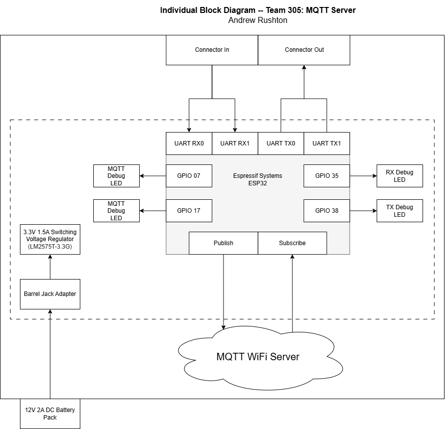

## Decision Process

The block diagram for my subsystem was developed based on the need for both UART message validation and MQTT-based fallback communication. Early in the design phase, the MQTT system was primarily intended to act as a relay node, but as the project progressed, its role expanded to include UART message filtering, MQTT publication, and fallback logic in the event of UART failure. The final block diagram reflects this integration of responsibilities, showing clear communication pathways between the sensor, motor, and HMI subsystems, as well as the dual-channel communication through both UART and MQTT. The inclusion of debug LEDs, state-tracking logic, and a local graphing interface helped the system fulfill reliability, visibility, and backup functionality requirements set during development.

[Block Diagram PDF](Images/BlockDiagram.pdf)
