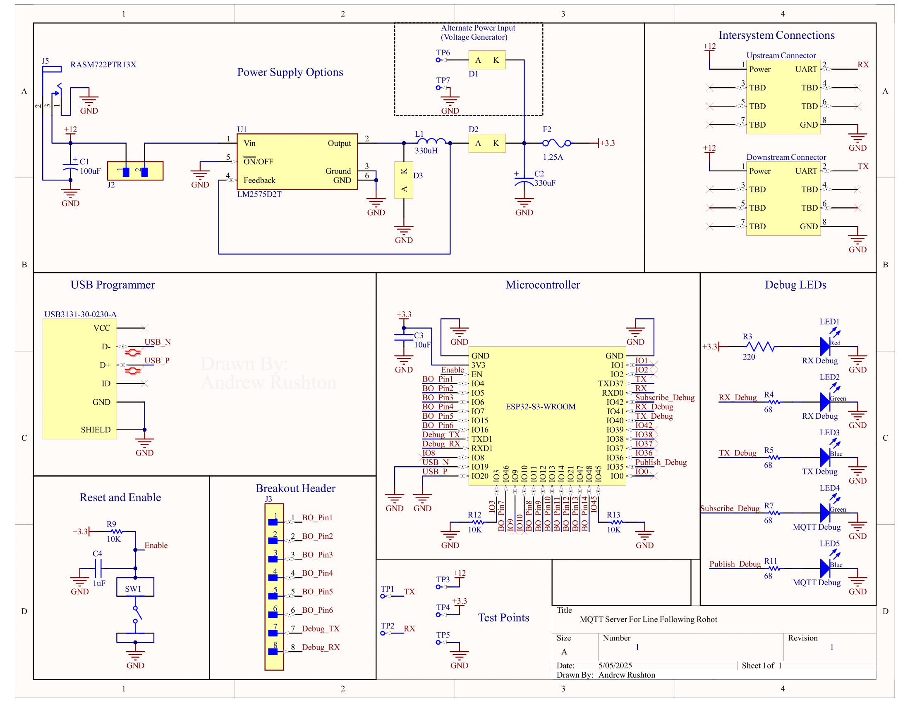
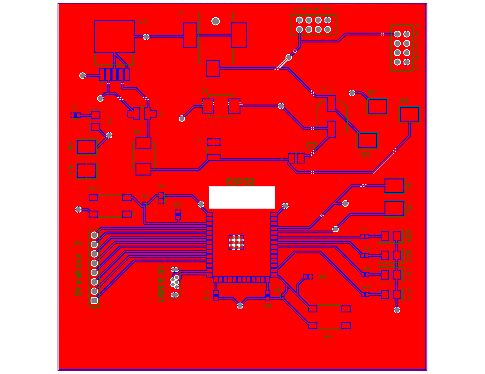

The following schematic and PCB shows the complete design for the MQTT subsystem, including the ESP32, supporting passives, UART lines, and power connections.

### Schematic

[Individual Schematic PDF](Images/Schematic.pdf)

### Top Layer

[View Full PDF](Images/PCB_Top.pdf)

### Bottom Layer

[View Full PDF](Images/PCB_Bottom.pdf)

## Schematic and PCB Design

The final schematic was based on a minimal but functional approach that supported UART communication, MQTT fallback, and LED-based debugging. It included the ESP32-S3-WROOM module, a 3.3V switching voltage regulator (MP1584), essential passive components, boot/reset buttons, and five debug LEDs. Careful attention was given to maintaining proper power decoupling, minimizing cross-talk, and preserving UART integrity for communication between microcontrollers. The pinout was selected to ensure availability for both UART and I2C functions while leaving enough flexibility for expansion.

The resulting PCB was a compact two-layer design that prioritized reliability, accessibility, and visibility for debugging. Each of the five debug LEDs was routed to a separate GPIO for step-by-step status feedback during startup and runtime. UART2 was exposed via labeled header pins for easy connection during integration, and buttons were included for both boot and reset functionality. While the board was small enough to fit into the team's mechanical housing, it also left room for additional headers and external sensor interfaces, striking a good balance between footprint and expandability. The layout was verified in Altium Designer and fabricated using JLCPCB. Both silkscreen and solder mask were applied, ensuring clear labeling and ease of assembly.

### Version 2.0 Hardware Improvements

If a Version 2.0 of this hardware design were developed, several practical changes would improve usability, clarity, and expandability. While breakout headers were included for GPIO access and UART, the design would benefit from adding dedicated 3.3V and GND lines to support external module testing or quick debugging. Additionally, optimizing GPIO pin selection earlier in the process would help avoid conflicts with unavailable or restricted pins on the ESP32-S3, which led to some routing limitations during firmware development. A more thoughtfully arranged silkscreen, including clearer labeling and orientation, would also assist with assembly and debugging. While the power regulation worked, switching to a lower-noise regulator or improving capacitor selection could enhance system stability, particularly for sensor inputs. Finally, although five debug LEDs proved helpful, adding even more visual indicators or onboard serial-to-USB conversion would further streamline debugging and reduce reliance on external tools.
