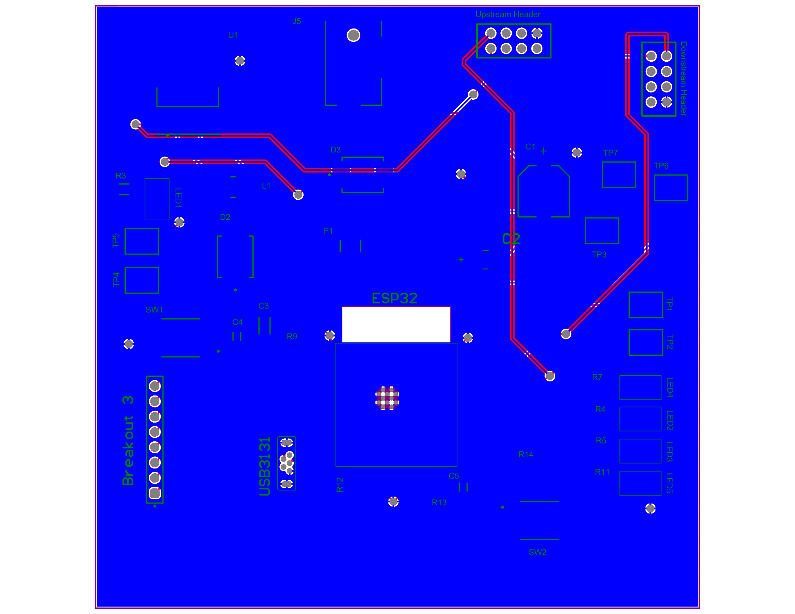

This PCB was designed for a two-layer board. Shown below are the top and bottom copper layers for the MQTT subsystem, including ESP32 placement, voltage regulation, UART connections, and debug indicators.

### Top Layer

[View Full PDF](Images/PCB_Top.pdf)

### Bottom Layer

[View Full PDF](Images/PCB_Bottom.pdf)
