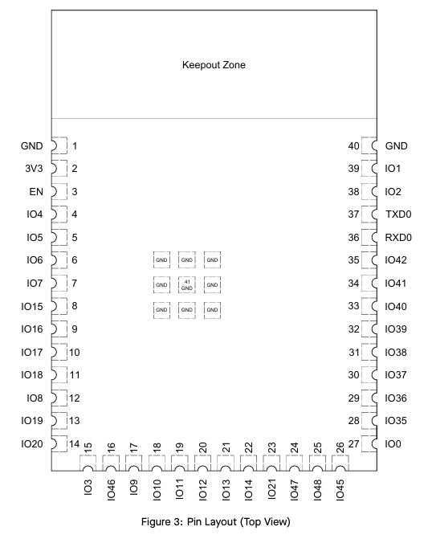

# My Subsystem
On my team, I am responsible for creating the MQTT server, as well as creating the power supply that will feed to the other three subsystems. The main goal of my subsystem will be to connect the project to a computer that will serve not only as the platform for the HMI system and controller but also display diagnostic data from the rest of the system. This data could include battery life, speed, current sensor calculation speed, or current data transfer speed. The exact diagnostics that will be displayed are still undecided by the group as of now, though. I will have UART connections to all three other subsystems, however I will only be sending and receiving data from the HMI subsystem; the other two will only be sending me data.
 
 
# Major Hardware Selection
This subsystem has no major hardware components for this section.   All components will either be small passive components (resistors, capacitors, etc) or the microcontroller
 
 
# Microcontroller Selection

| ESP Info                                      | Answer                                                                                                                               |
| --------------------------------------------- | ------------------------------------------------------------------------------------------------------------------------------------ |
| Model                                         | ESP32-S3-WROOM-1                                                                                                                     |
| Product Page URL                              | [Product Page](https://www.espressif.com/en/products/modules/page#ESP32-S3)                                                          |
| ESP32-S3-WROOM-1-N4 Datasheet URL             | [Data Sheet](https://www.espressif.com/sites/default/files/documentation/esp32-s3-wroom-1_wroom-1u_datasheet_en.pdf)                 |
| ESP32 S3 Datasheet URL                        | [ESP32-S3 Series Datasheet](https://www.espressif.com/sites/default/files/documentation/esp32-s3_datasheet_en.pdf)                   |
| ESP32 S3 Technical Reference Manual URL       | [Technical Reference Manual](https://www.espressif.com/sites/default/files/documentation/esp32-s3_technical_reference_manual_en.pdf) |
| Vendor link                                   | [Digikey Link](https://www.digikey.com/en/products/detail/espressif-systems/ESP32-S3-WROOM-1-N4/16162639)                            |
| Code Examples                                 | [PubSubLibrary](https://github.com/knolleary/pubsubclient)   [WiFi Library](https://github.com/arduino-libraries/WiFi)            |
| External Resources URL(s)                     | [ESP32 MicroPython: MQTT](https://youtu.be/ugEnE7XSR5I?si=Fv3zHxQ3zeP0jUnl)   [How to setup MQTT for Raspberry Pi and ESP32](https://youtu.be/ebsXSCKsHeQ?si=SOfk5tIESVuPY_7s)                                                                                                                                                                   |
| Unit cost                                     | $2.95                                                                                                                                |
| Absolute Maximum Current for entire IC        | 1500 mA                                                                                                                              |
| Supply Voltage Range                          | Min: 3.0V   Typical: 3.3V   Max: 3.6V                                                                                          |
| Maximum GPIO current   (per pin)           | Not explicitly stated in datasheet, however in general around 40mA max and 20mA typical.                                             |
| Supports External Interrupts?                 | Supports external interrupts which can also be used to wake from light sleep mode                                                    |
| Required Programming Hardware, Cost, URL      | [USD to Serial converter 5-10$](https://www.amazon.com/IZOKEE-CP2102-Converter-Adapter-Downloader/dp/B07D6LLX19/ref=sr_1_3?adgrpid=1330409641990384&dib=eyJ2IjoiMSJ9.qroPT-fyHbCHJ3tcPCCTQfWRI8aVGF1Xa7ZxFaJF9LZMTgBqYg3YnMxqbubd7viDdw_T94MoKF_7UtWKuCCOebeoGVe5et2rTnfrh9iC_hn_snBwX5FbfEboSq0eX1q9MR1r8YCT-GcYlrxQgXiivg2L_gIOq_3L4baNmX-jjSPmZemAlGkHT9GRgYIJJ9vUZtfyOIzaqS0kOh4-z1Vm7fHMl2-8sjURz31spK3cVGs.EzKKHT1QePqvJUjzSOqcp0mnXalQBORKEvpsg7AKnl8&dib_tag=se&hvadid=83150817082162&hvbmt=be&hvdev=c&hvlocphy=77892&hvnetw=o&hvqmt=e&hvtargid=kwd-83150962142855%3Aloc-190&hydadcr=19132_13351602&keywords=usb+to+uart+converter&mcid=c9ec1fe3b12d3f0e82d616b6cc8bb95d&qid=1738966734&sr=8-3)                                            |
 

| Module         | # Available | Needed |                        Associated Pins (or * for any)                        |
| -------------- | ----------- | ------ | ---------------------------------------------------------------------------- |
| UART           | 2           | 2      | Pins 10 & 37 (TX)   Pins 11 & 36 (RX)                                     |
| external SPI\* | 1           | 0      | SPI 0 & 1 (Reserved)   SPI 2 (Pins 18-21)   SPI 3 (Pins 27-30)         |
| I2C            | 2           | 0      | *                                                                            |
| GPIO           | 36          | ?      | Any except 1, 2, 3, 40 & 41                                                  |
| ADC            | 20          | 0      | ADC1 (Pins 4-7, 12, 15, 17, 18, 38, 39)   ADC2 (Pins 8-11, 13, 14, 19-22) |
| LED PWM        | 36          | 4      | *                                                                            |
| Motor PWM      | 36          | 0      | *                                                                            |
| USB Programmer | 1           | 1      | Pins (13 & 14 +VCC/Ground)                                                   |

# Final Selection
The determining factors for my microcontroller selection were speed and WiFi capability. The main requirements of the microcontroller for my subsystem are UART communication and WiFi capability. Any other required pins, such as GPIO pins, will be more plentifully available than I need on any board that I choose, so those were not considered in the decision. At a minimum, the subsystem requires 1 UART connection, but more would be easier to use. Both the ESP32 and PIC18 have at least one UART connection, so they both meet my requirements. The PIC does not have internal WiFi capabilities. While I can use external peripherals to supliment that, the ESP32 has the WiFi modules already built into it. The last consideration was speed. The PIC18 has an average clock speed of 40MHz, while the ESP32 has a speed of 240MHz and supports multithreading. This will be helpful when connecting to the MQTT server and handeling data from the other subsystems in real-time.

# ESP32 Diagram and Wiring

