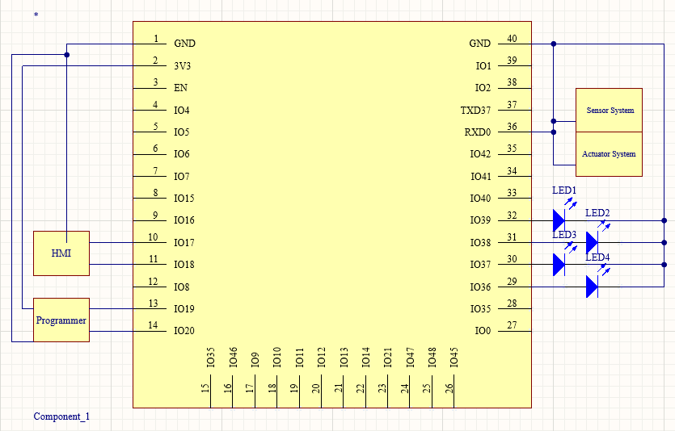

# My Subsystem
I was responsible for the development of the MQTT subsystem, which provided both communication reliability and system monitoring. The MQTT system served as a centralized message handler between the sensor and motor subsystems. It acted as a validation and control point for UART messages, ensuring that only correctly formatted and authorized messages were allowed through.

In addition to filtering messages, the subsystem served as a backup communication pathway in the event of UART failure. It also generated real-time graphs to visualize vehicle movement and message activity, allowing for performance analysis and debugging. Although early plans included integration with the HMI subsystem, that feature was ultimately removed from the system's scope.
 
 
# Major Hardware Selection
This subsystem includes very few major hardware components. Most supporting elements—such as resistors and capacitors—are standard passive components required for basic operation. The two most important hardware decisions were the selection of the ESP32 microcontroller and the use of a 3.3V switching voltage regulator to supply it with regulated power.

The ESP32 was chosen for its UART and WiFi capabilities, and is discussed in detail in the next section. The switching voltage regulator was not selected through a formal evaluation process, but was reused from earlier coursework. It had been previously tested and was known to meet the voltage and current requirements of the ESP32, making it a practical and reliable choice for this subsystem.
 
 
# Microcontroller Selection

| ESP Info                                      | Answer                                                                                                                               |
| --------------------------------------------- | ------------------------------------------------------------------------------------------------------------------------------------ |
| Model                                         | ESP32-S3-WROOM-1                                                                                                                     |
| Product Page URL                              | [Product Page](https://www.espressif.com/en/products/modules/page#ESP32-S3)                                                          |
| ESP32-S3-WROOM-1-N4 Datasheet URL             | [Data Sheet](https://www.espressif.com/sites/default/files/documentation/esp32-s3-wroom-1_wroom-1u_datasheet_en.pdf)                 |
| ESP32 S3 Datasheet URL                        | [ESP32-S3 Series Datasheet](https://www.espressif.com/sites/default/files/documentation/esp32-s3_datasheet_en.pdf)                   |
| ESP32 S3 Technical Reference Manual URL       | [Technical Reference Manual](https://www.espressif.com/sites/default/files/documentation/esp32-s3_technical_reference_manual_en.pdf) |
| Vendor link                                   | [Digikey Link](https://www.digikey.com/en/products/detail/espressif-systems/ESP32-S3-WROOM-1-N4/16162639)                            |
| Code Examples                                 | [PubSubLibrary](https://github.com/knolleary/pubsubclient)   [WiFi Library](https://github.com/arduino-libraries/WiFi)            |
| External Resources URL(s)                     | [ESP32 MicroPython: MQTT](https://youtu.be/ugEnE7XSR5I?si=Fv3zHxQ3zeP0jUnl)   [How to setup MQTT for Raspberry Pi and ESP32](https://youtu.be/ebsXSCKsHeQ?si=SOfk5tIESVuPY_7s)                                                                                                                                                                   |
| Unit cost                                     | $2.95                                                                                                                                |
| Absolute Maximum Current for entire IC        | 1500 mA                                                                                                                              |
| Supply Voltage Range                          | Min: 3.0V   Typical: 3.3V   Max: 3.6V                                                                                          |
| Maximum GPIO current   (per pin)           | Not explicitly stated in datasheet, however in general around 40mA max and 20mA typical.                                             |
| Supports External Interrupts?                 | Supports external interrupts which can also be used to wake from light sleep mode                                                    |
| Required Programming Hardware, Cost, URL      | [USD to Serial converter 5-10$](https://www.amazon.com/IZOKEE-CP2102-Converter-Adapter-Downloader/dp/B07D6LLX19/ref=sr_1_3?adgrpid=1330409641990384&dib=eyJ2IjoiMSJ9.qroPT-fyHbCHJ3tcPCCTQfWRI8aVGF1Xa7ZxFaJF9LZMTgBqYg3YnMxqbubd7viDdw_T94MoKF_7UtWKuCCOebeoGVe5et2rTnfrh9iC_hn_snBwX5FbfEboSq0eX1q9MR1r8YCT-GcYlrxQgXiivg2L_gIOq_3L4baNmX-jjSPmZemAlGkHT9GRgYIJJ9vUZtfyOIzaqS0kOh4-z1Vm7fHMl2-8sjURz31spK3cVGs.EzKKHT1QePqvJUjzSOqcp0mnXalQBORKEvpsg7AKnl8&dib_tag=se&hvadid=83150817082162&hvbmt=be&hvdev=c&hvlocphy=77892&hvnetw=o&hvqmt=e&hvtargid=kwd-83150962142855%3Aloc-190&hydadcr=19132_13351602&keywords=usb+to+uart+converter&mcid=c9ec1fe3b12d3f0e82d616b6cc8bb95d&qid=1738966734&sr=8-3)                                            |
 

| Module         | # Available | Needed |                        Associated Pins (or * for any)                        |
| -------------- | ----------- | ------ | ---------------------------------------------------------------------------- |
| UART           | 2           | 2      | Pins 10 & 37 (TX)   Pins 11 & 36 (RX)                                     |
| external SPI\* | 1           | 0      | SPI 0 & 1 (Reserved)   SPI 2 (Pins 18-21)   SPI 3 (Pins 27-30)         |
| I2C            | 2           | 0      | *                                                                            |
| GPIO           | 36          | 0      | Any except 1, 2, 3, 40 & 41                                                  |
| ADC            | 20          | 0      | ADC1 (Pins 4-7, 12, 15, 17, 18, 38, 39)   ADC2 (Pins 8-11, 13, 14, 19-22) |
| LED PWM        | 36          | 4      | *                                                                            |
| Motor PWM      | 36          | 0      | *                                                                            |
| USB Programmer | 1           | 1      | Pins (13 & 14 +VCC/Ground)                                                   |

&nbsp;

# Final Selection
The final microcontroller selection was based primarily on processing speed and WiFi capability. The subsystem required at least one UART interface and a reliable wireless connection. While the PIC18 met the UART requirement, it lacked onboard WiFi, which would have required additional components and complexity. In contrast, the ESP32 included integrated WiFi, simplifying both hardware and software design.

In addition to connectivity, the ESP32 offered a 240 MHz clock speed and support for dual-core processing, which was beneficial for handling concurrent MQTT and UART communication tasks. The PIC18, by comparison, operated at only 40 MHz and would have presented performance limitations for this subsystem’s requirements.

&nbsp;

# ESP32 Diagram and Wiring

