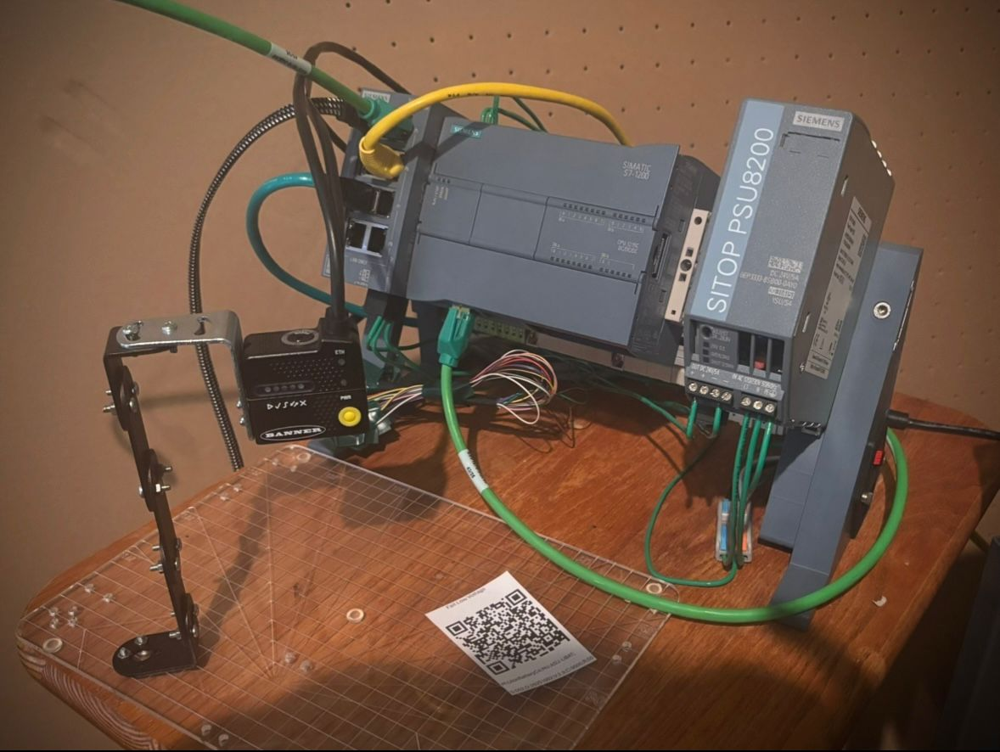
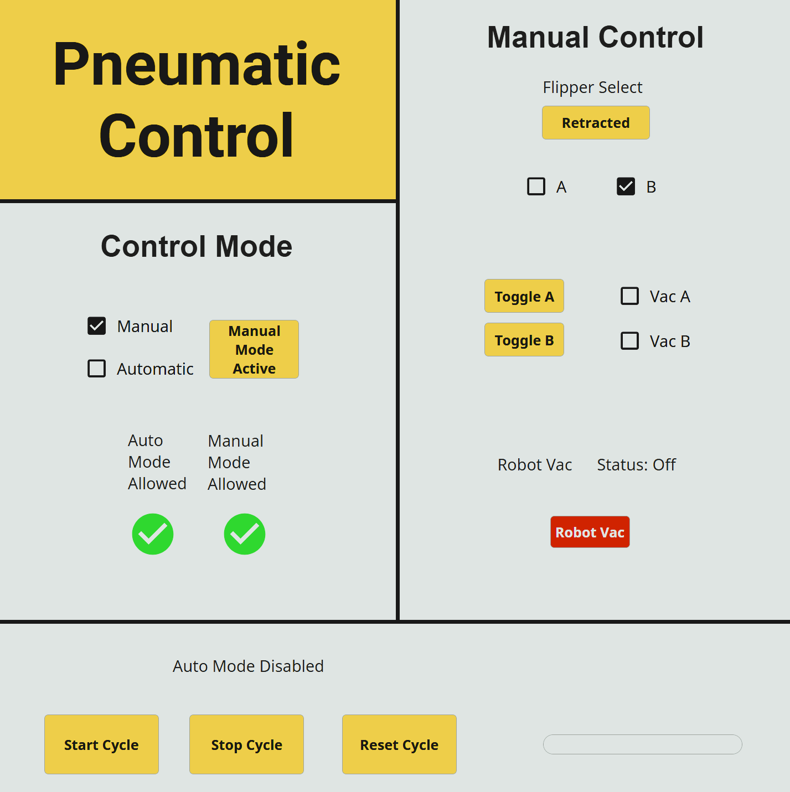
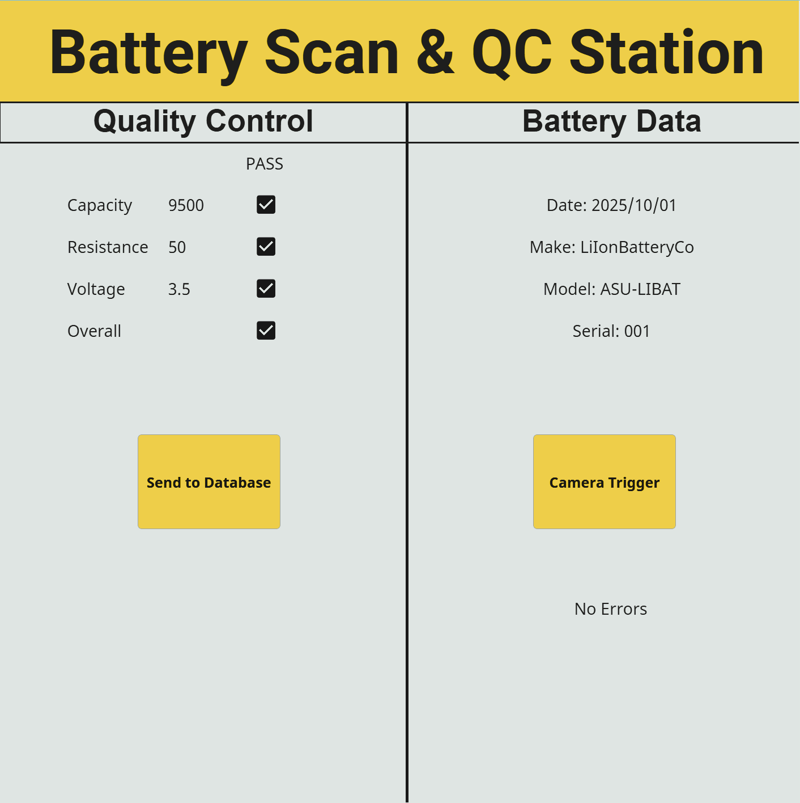

# Gallery & Demonstrations

## Overview

This section contains demonstration media, hardware photographs, SCADA captures, and system-sequence visualizations collected throughout development of the Automated Battery Sorting System.

The gallery highlights the final integrated system and demonstrates interaction between the PLC, pneumatic hardware, machine vision subsystem, SCADA interface, and industrial communication architecture.

The media below documents both the completed automation platform and the engineering workflow used throughout subsystem integration and testing.

---

## Final Integrated System

### Completed Hardware Integration

The completed system integrated:

- Siemens S7-1200 PLC
- Banner ABR3000 vision sensor
- Ignition Perspective SCADA system
- SMC pneumatic hardware
- Industrial Ethernet communication
- SQL database logging

The final implementation demonstrated coordinated operation between multiple industrial automation subsystems within a unified control architecture.



---

## System Demonstration

### Automated Sequence Operation

The completed system demonstrated coordinated pneumatic sequencing, scanner communication, PLC processing, SCADA monitoring, and database interaction during automatic operation.

The demonstration workflow included:

1. Pneumatic battery transfer
2. Scanner positioning
3. QR-code acquisition
4. PLC-based message parsing
5. SCADA visualization
6. Database logging
7. Sequence reset and completion

The final sequence architecture emphasized deterministic operation, subsystem coordination, and reliable communication between industrial hardware and software platforms.

### Demonstration Video

### Demonstration Video


---

## SCADA Demonstration

### Pneumatic Control Interface

The pneumatic-control interface provided operators with:

- Start/stop/reset controls
- Automatic/manual mode selection
- Pneumatic diagnostics
- Manual output controls
- Sequence-state visibility
- System-status monitoring

The interface became one of the primary development and troubleshooting tools used throughout subsystem integration and testing.

{ .scada-shot }

---

### Battery Scan & QC Interface

A dedicated battery-scan interface displayed:

- Parsed QR information
- Quality-control values
- Scanner status indicators
- Trigger controls
- Pass/fail results
- Database interaction controls

The separation between pneumatic operation and scanner interaction simplified subsystem debugging and improved operator visibility throughout development.

{ .scada-shot }

---

### SCADA Demonstration Video

<video controls preload="metadata" width="100%">
  <source src="../Images/SCADA_Display.mp4" type="video/mp4">
</video>

---

## Sequence Architecture

### Pneumatic State-Machine Logic

The automated transfer process was coordinated through a PLC-controlled state-machine architecture responsible for:

- Pneumatic timing
- Vacuum handoff coordination
- Scanner synchronization
- Reset behavior
- Sequence-state management

The sequence logic evolved significantly throughout development as subsystem integration exposed additional timing, synchronization, and transfer-stability challenges.

Insert state-machine sequence diagram.

---

## Final Demonstration Summary

### Completed System Functionality

The completed project successfully demonstrated:

- PLC-controlled automation
- Industrial Ethernet communication
- Machine vision integration
- Pneumatic sequencing
- Ignition SCADA functionality
- SQL database logging
- Manual and automatic operation
- Real-time subsystem coordination

The final implementation served as a fully integrated industrial automation platform combining industrial hardware, industrial communication protocols, PLC control logic, machine vision systems, and SCADA architecture into a coordinated and functional automation workflow.
```
