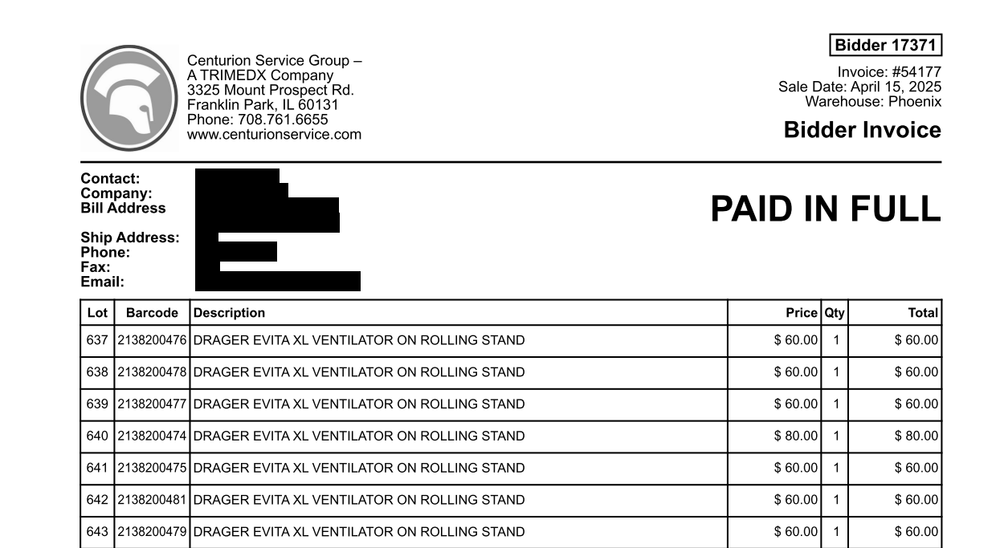
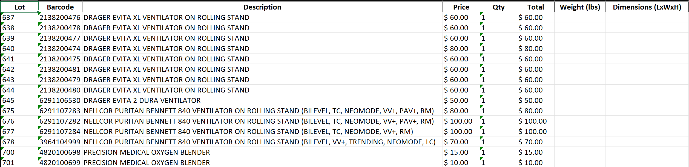
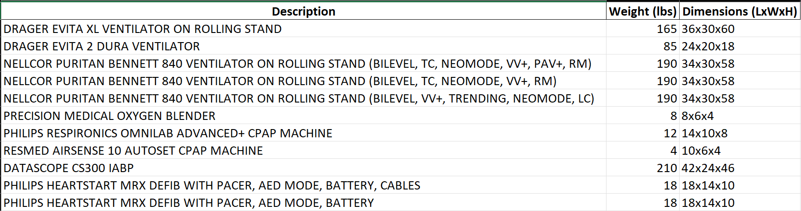
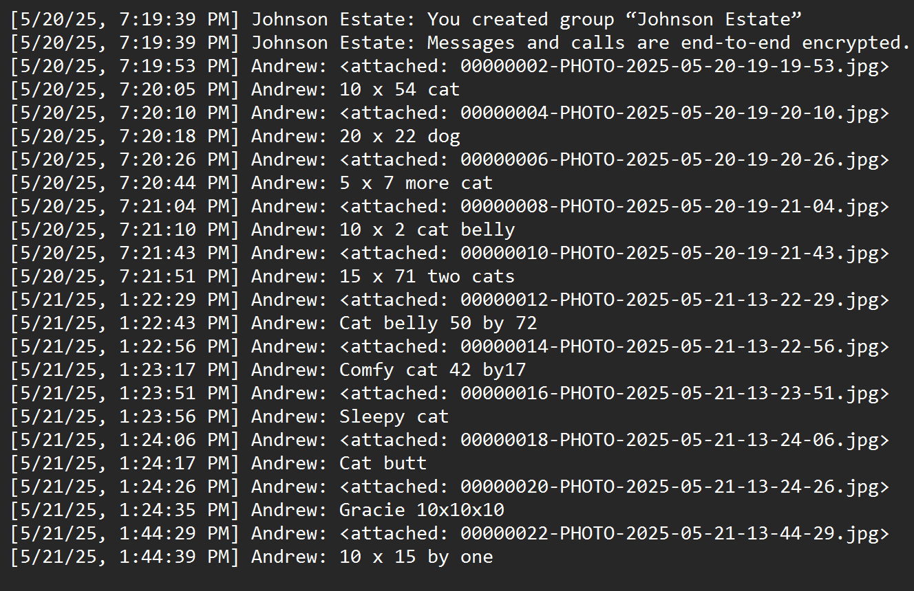
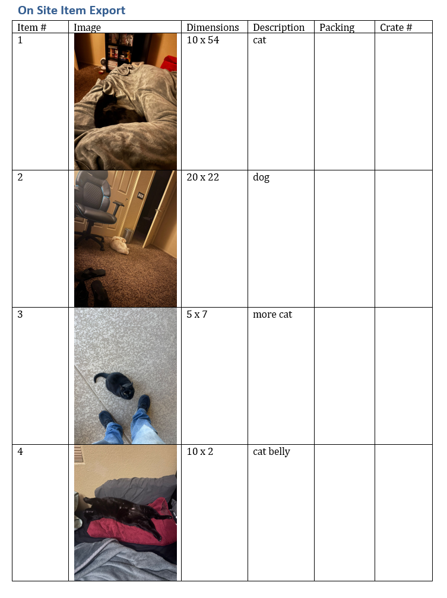

# Operational Automation Tools

## Overview

This section contains a collection of Python-based workflow automation tools developed to reduce repetitive manual processing tasks within shipping, logistics, and operational-estimating workflows.

While these projects are generally smaller in scope than the larger robotics and automation systems elsewhere in this portfolio, they demonstrate an important engineering mindset:

- identify repetitive work
- analyze deterministic patterns
- design reliable automation
- reduce manual intervention

These tools were developed after spending significant time working directly with the associated workflows and identifying opportunities to reduce repetitive formatting, parsing, and data-entry work.

The projects emphasized:

- Structured document parsing
- Workflow automation
- Reusable operational data
- Human-in-the-loop automation
- Practical process optimization
- Python-based scripting and data handling

---

## Medical Equipment Invoice Processing System

### Operational Problem

Navis frequently worked with a medical-equipment auction company that handled inventory from hospitals undergoing closure, renovation, or equipment replacement. Customers purchasing equipment through these auctions were often referred to us for shipping and logistics services.

The auction company generated invoices in a highly consistent format that contained:

- Item descriptions
- Lot numbers
- Barcodes
- Quantities
- Purchase totals

However, the invoices typically did not contain critical shipping information such as:

- Item weight
- Shipping dimensions
- Packaging requirements

Estimators were therefore required to manually process every invoice and research shipping data for each individual item before generating shipping quotes.

Because many auction items were repeated frequently between auctions, the workflow involved a large amount of repetitive manual lookup and spreadsheet formatting work.

---

### Project Goals

The goals of the automation system were:

- Automatically identify valid invoice emails
- Extract invoice PDFs from `.eml` files
- Parse invoice contents into structured data
- Generate organized Excel spreadsheets for estimators
- Reduce repetitive manual formatting work
- Build a reusable item-reference database for repeated inventory items
- Gradually reduce human workload over time

The project was intentionally designed as a semi-automated workflow rather than a fully autonomous system.

---

### Processing & Data Pipeline

#### High-Level Processing Pipeline

```text
Incoming .eml Files
        ↓
PDF Attachment Extraction
        ↓
Invoice Validation
        ↓
PDF Text Parsing
        ↓
Structured Data Extraction
        ↓
Excel Spreadsheet Generation
        ↓
Item Database Lookup / Update
```

The project was built around converting highly repetitive invoice-processing workflows into structured operational data while minimizing manual estimator intervention.

---

#### Invoice Filtering & PDF Extraction

The system first scanned `.eml` email files and extracted PDF attachments from incoming messages.

The script then filtered valid auction invoices by searching for known invoice identifiers within the PDF contents.

##### Example Invoice Detection Logic

```python
return "Centurion Service Group" in text and "Bidder" in text
```

This filtering stage prevented unrelated attachments and non-invoice emails from entering the processing pipeline.



---

#### PDF Parsing & Structured Data Extraction

After identifying a valid invoice, the system parsed the PDF contents using PyMuPDF block extraction and regular-expression matching.

The parser extracted:

- Lot number
- Barcode
- Description
- Price
- Quantity
- Total cost

##### Example Parsing Logic

```python
blocks = page.get_text("blocks")
```

```python
match_vals = re.findall(r'\$\s*\d+(?:,\d{3})*(?:\.\d{2})?', text)
```

The extracted data was then converted into a structured spreadsheet format for estimator use.



---

### Persistent Item Reference Database

One of the primary design goals of the project was reducing repetitive manual data entry over time.

Although auction invoices frequently changed between jobs, many individual inventory items appeared repeatedly across multiple auctions. Instead of repeatedly researching shipping information for common items, the system maintained a persistent Excel-based item reference database containing:

- Item descriptions
- Shipping weights
- Shipping dimensions

When repeated inventory items appeared in future invoices, the system automatically reused the stored information instead of requiring estimators to manually research the item again.

#### Database Workflow

```text
Unknown Item
        ↓
Manual Weight/Dimension Entry
        ↓
Stored in Reference Database
        ↓
Future Invoice Detection
        ↓
Automatic Data Population
```

This allowed the system to become more effective over time as additional inventory items were processed and cataloged.

The database was intentionally implemented using an Excel-based structure rather than a larger SQL-style database because:

- Data volume was relatively small
- The file needed to remain human-readable
- Nontechnical users needed easy access
- Operational simplicity was prioritized



---

### Automation Philosophy & Design Decisions

#### Automation Boundary

Some downstream estimating decisions, such as packing method and crate assignment, followed highly repeatable rule-based patterns most of the time. However, the remaining exceptions carried enough operational risk that those fields were intentionally left open for estimator review.

The goal of the project was not to replace judgment-based shipping decisions. The goal was to eliminate repetitive formatting, parsing, and data-entry work so that estimators could focus their time on validating and planning shipments rather than rebuilding spreadsheets manually.

This design philosophy intentionally prioritized operational reliability over aggressive automation.

---

### Technical Implementation

#### Libraries & Technologies Used

- Python
- PyMuPDF (`fitz`)
- pandas
- regular expressions (`re`)
- Excel file generation
- `.eml` email parsing

#### Major Functional Components

- Email attachment extraction
- PDF validation
- Block-based PDF parsing
- Structured invoice extraction
- Spreadsheet generation
- Duplicate-item handling
- Persistent inventory database updates

#### Example Database Handling Logic

```python
item_db.drop_duplicates(subset=["Description"], keep="first", inplace=True)
```

---

## WhatsApp Job Evaluation Parser

### Operational Problem

Navis frequently performed on-site evaluations for large or unusual shipping projects. During these evaluations, managers documented inventory items using mobile-phone photos and short text descriptions shared through the company WhatsApp chat.

Historically, this process created large unstructured message threads consisting of:

```text
Single Image
Description

Single Image
Description
```

After returning to the office, estimators manually:

- Saved images individually
- Reorganized photos
- Matched descriptions to images
- Rebuilt the information into estimate tables
- Added operational packing information

This process was repetitive, time-consuming, and highly formatting-dependent.

---

### Project Goals

The goals of the parser were:

- Automatically process WhatsApp export files
- Associate images with descriptions
- Rebuild the message thread into a structured estimate format
- Generate organized Word documents
- Reduce repetitive formatting work
- Preserve manual estimator control where operational judgment was required

The script focused specifically on automating the deterministic formatting and organization tasks within the workflow.

---

### Processing Workflow

#### High-Level Processing Pipeline

```text
WhatsApp Export ZIP
        ↓
ZIP Extraction
        ↓
Chat Log Parsing
        ↓
Image / Description Matching
        ↓
Dimension Extraction & Cleanup
        ↓
Structured Table Generation
        ↓
Word Document Export
```

The parser converted unstructured mobile-phone documentation into structured operational estimate documents suitable for internal workflow processing.

---

#### Structured Message Parsing

The parser operated using a standardized message structure:

```text
Single Image → Description → Single Image → Description
```

The script scanned exported WhatsApp chat logs and identified image attachments followed by the next valid descriptive message.

##### Example Parsing Logic

```python
image_match = re.search(r"<attached:\s*(.+\.jpg)>", line)
```

After identifying image attachments, the parser reconstructed image-description pairs into structured operational records.

The script also included additional cleanup logic to handle inconsistent formatting generated by mobile-phone speech-to-text workflows.



---

#### Speech-to-Text Normalization

In many on-site evaluations, dimensions were verbally dictated into mobile devices. This frequently produced inconsistent formatting such as:

```text
20 by four by 12
```

The parser automatically normalized common spoken-number patterns into standardized dimensional formatting before extraction.

##### Example Cleanup Logic

```python
for word, digit in word_to_digit.items():
    full_text = re.sub(
        rf"((?:x|by)\s+){word}\b",
        lambda m: m.group(1) + digit,
        full_text,
        flags=re.IGNORECASE
    )
```

This allowed the parser to remain usable even when field documentation was created quickly using speech-to-text input on mobile devices.

---

#### Dimension Extraction & Formatting

After cleanup, the parser extracted dimensions using regular-expression pattern matching.

##### Example Dimension Parsing Logic

```python
dim_pattern = re.compile(
    r"((?:\d+\s*(?:x|by)\s*){1,2}\d+)", re.IGNORECASE
)
```

The extracted dimensions were then normalized into a standardized format:

```text
L x W x H
```

This allowed estimators to quickly review item sizing information without manually reorganizing mobile-phone notes.

---

#### Automated Word Document Generation

After parsing the chat export, the script generated a structured Word document containing:

- Embedded item images
- Dimensions column
- Description column
- Packing column
- Crate-number column

##### Example DOCX Generation Logic

```python
table = doc.add_table(rows=1, cols=6)
```

##### Embedded Image Handling

```python
add_picture(image_path, width=Inches(1.5))
```

The final result converted an unstructured mobile message thread into a clean estimator-ready document.



---

### Human-in-the-Loop Design Philosophy

The script intentionally automated:

- image organization
- document formatting
- image/description association
- dimension extraction
- table generation

while leaving operational decisions such as:

- packing method
- crate assignment
- shipment grouping

available for manual estimator review.

Although many of these downstream decisions followed highly repeatable rules, the remaining edge cases carried enough operational variability that the project intentionally prioritized reliability and estimator oversight over aggressive automation.

---

### Technical Implementation

#### Libraries & Technologies Used

- Python
- ZIP extraction
- regular expressions (`re`)
- `python-docx`
- automated image insertion
- structured document generation

#### Major Functional Components

- ZIP extraction
- Automatic job-folder creation
- Chat-log parsing
- Image matching
- Speech-to-text normalization
- Dimension extraction
- Text cleanup
- Structured table creation
- Word-document export
- Automated file cleanup

---

### Project Outcome

This tool significantly reduced repetitive formatting and organizational work during on-site estimate preparation while preserving estimator oversight where human judgment remained important.

The project demonstrated practical workflow automation using:

- unstructured text parsing
- regex-based data extraction
- document automation
- automated image handling
- human-in-the-loop operational tooling
